# 🧠 AI Context Rules System

## 🌟 Quick Overview
A streamlined system for managing AI interactions through memory management, lessons learned tracking, and dual-mode operation (Plan/Act).

## 🔄 Core Flow
1. **Memory System** (`@memories.md`)
   - Tracks all interactions
   - Updates automatically
   - Maintains project context

2. **Lessons Learned** (`@lessons-learned.md`)
   - Captures solutions
   - Documents best practices
   - Prevents repeated issues

3. **Scratchpad** (`@scratchpad.md`)
   - Manages current phase
   - Tracks implementation
   - Monitors confidence

## 🎯 How It Works

```mermaid
graph TD
    A[User Request] --> B[Plan Mode 🎯]
    B --> C[Check Rules]
    C --> D[Read Memories]
    D --> E[Verify Requirements]
    E --> F{95% Confidence?}
    F -->|Yes| G[Act Mode ⚡]
    F -->|No| H[Ask Questions]
    H --> D
```



## 🚀 Usage Flow

1. **Start: Plan Mode** 🎯
   ```
   - Trigger: "plan"
   - System reads: @memories.md, @lessons-learned.md
   - Checks: project requirements
   - Builds: confidence score
   ```

2. **Transition: 95% Confidence**
   ```
   - All questions answered
   - Requirements verified
   - Implementation path clear
   ```

3. **Execute: Act Mode** ⚡
   ```
   - Trigger: "agent"
   - Implements solution
   - Updates documentation
   - Tracks progress
   ```

## 💡 Key Rules

1. **Always Active**
   - Brain-memories-lessons-learned rules
   - Documentation standards
   - Project requirements

2. **Mode System**
   - Plan Mode (Default)
   - Act Mode (95% confidence)
   - Clear transitions

3. **Documentation**
   - Real-time updates
   - Cross-referencing
   - Phase tracking

## 🎯 Tips & Tricks

### 🔄 Handling AI Hallucinations & Cursor Issues
1. **Open Required Tabs**:
   ```
   1️⃣ Active file you're working on
   2️⃣ Cursor Settings (Feature tab → Resync Index)
   3️⃣ .cursorrules file (keep open for auto-reload)
   ```

2. **Reload Process**:
   ```
   1. Press Ctrl+Shift+P
   2. Type "Developer: Reload Window"
   3. Wait 3-10 seconds for complete reload
   ```

3. **When to Use**:
   - AI seems confused or unresponsive
   - Cursor not working properly
   - Unexpected behavior
   - Need to refresh codebase indexing

### 💡 Additional Tips
- Best practices for memory management
- Efficient confidence building
- Quick mode transitions
- Documentation shortcuts
- Common pitfalls to avoid

## 🔍 Directory Structure
```
.cursor/
├── memories.md          # Interaction history
├── lessons-learned.md   # Solutions & practices
├── scratchpad.md       # Current phase tracking
└── rules/              # System rules
```

## 🤝 Contributing

Feel free to enhance this system by:
1. Adding custom rules
2. Improving memory tracking
3. Enhancing confidence metrics
4. Documenting best practices

## 📝 License

MIT License - Free to use and modify!

---

*Note: This system is designed for seamless AI interaction management. For detailed implementation guidelines, refer to the individual rule files.* 🚀

# Intellitonic Admin

A modular WordPress admin plugin with toggleable features.

## Features
- Feature toggle system with dependency management
- Modular architecture with self-registering features
- WordPress Settings API integration
- Proper caching and performance optimization
- Comprehensive security measures

## Requirements
- WordPress 5.8+
- PHP 7.4+
- Composer for dependency management

## Installation
1. Clone this repository to your `wp-content/plugins` directory
2. Run `composer install`
3. Activate the plugin through WordPress admin

## Development
- Follow WordPress Coding Standards
- Use PSR-4 autoloading
- Implement proper hooks system
- Maintain comprehensive documentation

## Security
- All features require 'manage_options' capability
- Proper nonce verification
- Input sanitization
- XSS prevention

## License
GPL v2 or later
